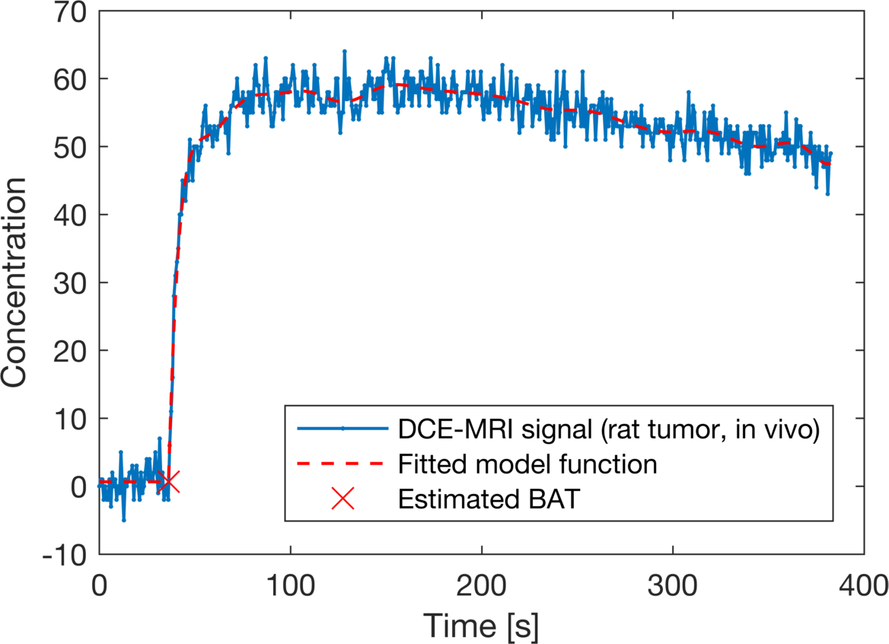

# Bolus arrival time estimation for DCE-MRI signals (DCEBE)

## Description
This Matlab code estimates the bolus arrival time (BAT) of DCE-MRI signals.
It is particularly intended to work with signals that do not have a fast upslope
as it is often the case for data of small animals.
The proposed method employs a spline-based approximation model.
Parameter estimation is done by generalized cross validation.

## Quickstart
- Run "DCEC_install.m" or add subfolders manually to Matlab path 
- Run a demo script from the demos folder, e.g. "DCEBE_demo.m"

## How to cite
The method is described in the paper

- A. Bendinger, C. Debus, C. Glowa, C. Karger, J. Peter, M. Storath,
"Bolus arrival time estimation in dynamic contrast-enhanced MRI of small animals based on spline models".

## Acknowledgement 
Thanks to T. Driscoll for sharing his code for [computing finite difference weights.](https://de.mathworks.com/matlabcentral/fileexchange/13878-finite-difference-weights)
