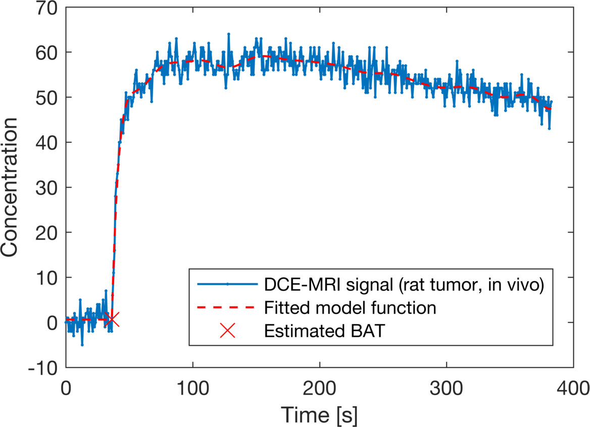

# DCEBE — Bolus arrival time estimation for DCE-MRI signals

[](https://pypi.org/project/dcebe/)
[](https://pypi.org/project/dcebe/)
[](LICENSE)
[](https://github.com/mstorath/DCEBE/actions/workflows/ci.yml)
[](#matlab)
[](https://de.mathworks.com/matlabcentral/fileexchange/69526-dcebe)

Spline-based estimator for the bolus arrival time (BAT) of DCE-MRI signals — particularly intended for signals without a fast upslope, as is typical for small-animal data. Parameters are selected via generalised cross-validation.



## Paper

> A. Bendinger, C. Debus, C. Glowa, C. Karger, J. Peter, M. Storath.
> [*Bolus arrival time estimation in dynamic contrast-enhanced MRI of small animals based on spline models.*](https://doi.org/10.1088/1361-6560/aafce7)
> Physics in Medicine & Biology 64(4), 2019. [preprint](https://arxiv.org/pdf/1811.10672.pdf).

## Quickstart

### Python

```bash
pip install dcebe
```

```python
import numpy as np
from dcebe import estimate_bat

# y: (N,) or (N, M) array of DCE-MRI signals
result = estimate_bat(y, search_interval=(10, 30))

# 1-based BAT in sample units; convert to seconds via:
bat_sec = (result.bat - 1) * delta_t
```

The package is pure Python (NumPy + SciPy); no compiled wheels, no Rust, no MATLAB runtime required.
See [`README_PYTHON.md`](README_PYTHON.md) for the full Python API, including
the `EstimateResult` fields, and [`demos_py/`](demos_py/) for usage examples.

### MATLAB

The original MATLAB reference implementation is in this same repository:

1. Run `DCEBE_install.m` (or add subfolders manually to the MATLAB path).
2. Run a demo from the `demos/` folder, e.g. `DCEBE_demo.m`.

## How to cite

If you use this software, please cite the paper above. GitHub's "Cite this repository" button on the repo page reads the `version` and `date-released` fields from [`CITATION.cff`](CITATION.cff) and renders BibTeX/APA.

## See also

Sibling projects from the same research program on variational methods for signal and image processing:

- [Pottslab](https://github.com/mstorath/Pottslab) — multilabel image segmentation via the Potts / piecewise-constant Mumford-Shah model
- [L1TV](https://github.com/mstorath/L1TV) — exact L1-TV regularisation of real- or circle-valued signals
- [CSSD](https://github.com/mstorath/CSSD) — cubic smoothing splines for signals with discontinuities
- [MumfordShah2D](https://github.com/mstorath/MumfordShah2D) — edge-preserving image restoration via the Mumford-Shah model
- [CircleMedianFilter](https://github.com/mstorath/CircleMedianFilter) — fast median filtering for phase or orientation data

## Acknowledgement

Thanks to T. Driscoll for sharing his code for [computing finite difference weights](https://de.mathworks.com/matlabcentral/fileexchange/13878-finite-difference-weights).

## License

Released under the Apache License 2.0. See [LICENSE](LICENSE).

---

### Project history

The Python re-implementation of this codebase was generated from the original MATLAB reference by a Claude coding agent in 2026.
See [`PORTED_BY.md`](PORTED_BY.md) for full attribution.
